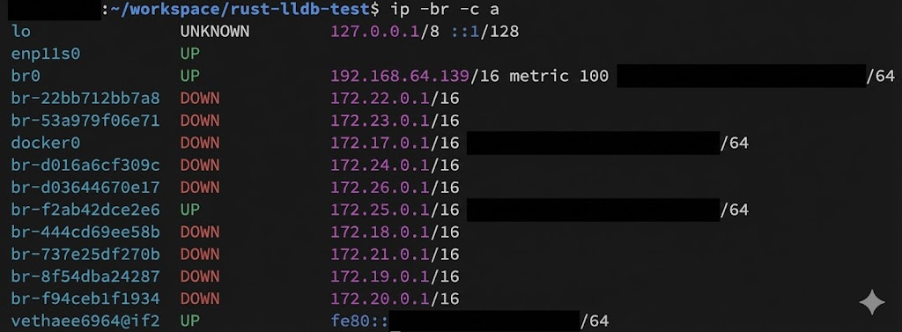

## IP コマンドの苦労

ネットワークインターフェースの設定や確認に `ip` コマンドを使う。しかし、NIC が多い環境（追加の物理NIC、VM、コンテナ、vLAN 利用時など）では、出力が多くなり、目的の情報を探すのが大変になる。

## 見やすくする方法

ip command manpage: <https://man7.org/linux/man-pages/man8/ip.8.html>

### brief オプション

`-br`（`-brief`）オプションを使うと、出力が簡潔になり、見やすくなる。

```bash
ip -br a
```

```plaintext:出力結果
lo               UNKNOWN        127.0.0.1/8 ::1/128 
enp11s0          UP             
br0              UP             192.168.64.139/16 metric 100 <MAC アドレス>/64 
br-22bb712bb7a8  DOWN           172.22.0.1/16 
br-53a979f06e71  DOWN           172.23.0.1/16 
docker0          DOWN           172.17.0.1/16 <MAC アドレス>/64 
br-d016a6cf309c  DOWN           172.24.0.1/16 
br-d03644670e17  DOWN           172.26.0.1/16 
br-f2ab42dce2e6  UP             172.25.0.1/16 <MAC アドレス>/64 
br-444cd69ee58b  DOWN           172.18.0.1/16 
br-737e25df270b  DOWN           172.21.0.1/16 
br-8f54dba24287  DOWN           172.19.0.1/16 
br-f94ceb1f1934  DOWN           172.20.0.1/16 
vethaee6964@if2  UP             <MAC アドレス>/64 
```

### Color オプション

`-c`（`-color`）オプションを使うと、色付きでさらに見やすくなる。

```bash
ip -br -c a
```


