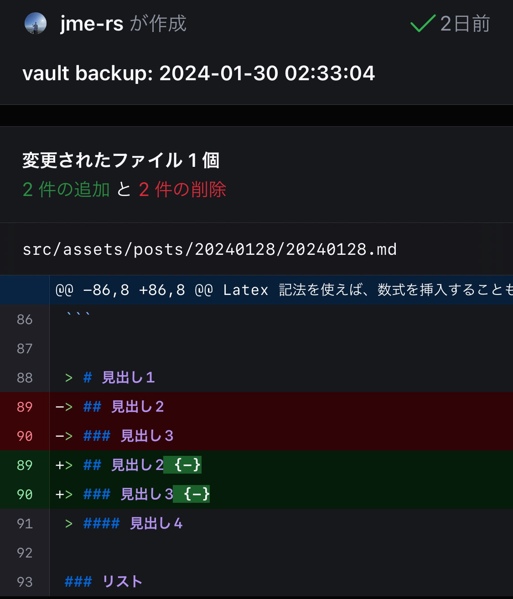
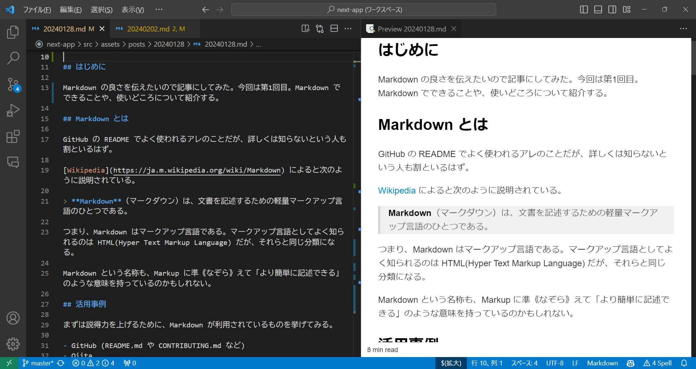

## はじめに

Markdown の良さを伝えたいので記事にしてみた。Markdown でできることや、使いどころについて紹介する。

## Markdown とは

GitHub の README でよく使われるアレのことだが、詳しくは知らないという人も割といるはず。

[Wikipedia](https://ja.m.wikipedia.org/wiki/Markdown) によると次のように説明されている。

> **Markdown**（マークダウン）は、文書を記述するための軽量マークアップ言語のひとつである。

つまり、Markdown はマークアップ言語である。マークアップ言語としてよく知られるのは HTML(Hyper Text Markup Language) だが、それらと同じ分類になる。

Markdown という名称も、Markup に準《なぞら》えて「より簡単に記述できる」のような意味を持っているのかもしれない。

## 活用事例

まずは説得力を上げるために、Markdown が利用されているものを挙げてみる。

- GitHub (README.md や CONTRIBUTING.md など)
- Qiita
- Zenn
- note
- Slack
- Notion
- はてなブログ
- Jupyter Notebook
- このブログ

名だたるサービスが Markdown を利用していることがわかる。GitHub や Slack で馴染みのある人もいるのではないだろうか。ちなみにこの記事も Markdown で書かれている。

## どんな場面で使うのか

「Word でがっちり資料を作るほどでもないが、見やすいようにフォーマットしたい」と感じたことはないだろうか。例えば、

- 講義の要約
- 会議の議事録
- 調査のメモ

など。Markdown は、ノート、メモなど文書で情報を管理する場面で活用できる。テキストファイルでメモを取る際にMarkdown 記法を使えば、体裁の整った意味のある文書を作成できる。

## 何が良いのか

### 専用のエディタやビューワが必要ない

Word ファイルは、複数の XML ファイルのアーカイブ形式となっている。専用のエディタがないと表示、編集することができない。ソフトを起動するのにも時間がかかる。

Markdown ファイルはテキストファイルなので、ほとんどの OS、ソフトウェアの標準で簡単に表示、編集ができる。

### GitHub で差分管理ができる

テキストファイルなので、何行目に変更がされたのかを可視化することができる。組織で管理する場合にも役立つ。



### 簡潔な文法

HTML は、タグを覚えて、終わりにもタグを書かなければならない。インデントが深くなりがちで、人間が普段使いするには向かない。

Word は GUI をポチポチしなければならない。どこに何があるのか分からないことも多いし、インデントの管理も複雑。

Markdown は基本的に簡潔な文法になっており、少ない労力で体裁の整った文書を記述することができる。

### プレーンテキストでも見やすい

Markdown は、ビューワを使うことで記述に応じた見た目で閲覧することができる。例えば、ヘッダを大きくしたり、コードブロックにシンタックスハイライトを効かせたりできる。

しかし、ビューワを用いなくても洗練された記号の使い方によって、その部分が何を意味するのかが容易に想像できる。

VSCode で Markdown をプレビューした例 ↓。



### 強力なエコシステム

Markdown の活用の幅は非常に広い。Pandoc というソフトを使えば、Markdown から PDF、Word、HTML、Latex など、あらゆるファイル形式に変換することができる。

Mermaid を使えば、フローチャートやシーケンス図、ガントチャート、円グラフなど、あらゆる図を生成することができる。Latex 記法を使えば、数式を挿入することもできる

## 記述例

次のような Markdown があったとする。

```txt:サンプル
## Rust について

今回は、システムプログラミング言語である Rust について調査する。

### 特徴

- コンパイル型で、バイナリに変換される。
- メモリ安全性が保証されている。
- GC はなく非常に高速である。
- Windows や Linux のカーネルで、C言語の置き換えとして注目されている。

### コードの例

\```rust
fn main() {
    println!("Hello, World!");
}
\```

### 速度

https://iwasiman.hatenablog.com/entry/20220905-rust-superspeed-story

| 言語       | Ruby     | Python   | PHP     | JavaScript (Node.js 16.16.0) | Java     | Go       | Rust     |
| ---------- | -------- | -------- | ------- | ---------------------------- | -------- | -------- | -------- |
| バージョン | 2.6.8    | 3.9.13   | 7.4.3   | -                            | 18.0.2   | 1.18     | 1.62.1   |
| 1万        | 6.8秒    | 8.6秒    | 4.8秒   | 0.4秒                        | 0.2秒    | 0.54秒   | 0.42秒   |
| 10万       | 11分26秒 | 15分58秒 | 7分56秒 | 11.8秒                       | 8.5秒    | 4.7秒    | 4.9秒    |
| 100万      | 未測定   | 未測定   | 未測定  | 23分16秒                     | 14分23秒 | 10分5秒  | 10分13秒 |
| 200万      | 未測定   | 未測定   | 未測定  | 1時間26分5秒                 | 58分31秒 | 45分10秒 | 43分37秒 |
```

以下は描写後である。

> ## Rust について
>
> 今回は、システムプログラミング言語である Rust について調査する。
>
> ### 特徴
>
> - コンパイル型で、バイナリに変換される。
> - メモリ安全性が保証されている。
> - GC はなく非常に高速である。
> - Windows や Linux のカーネルで、C言語の置き換えとして注目されている。
>
> ### コードの例
>
> ```rust
> fn main() {
>     println!("Hello, World!");
> }
> ```
>
> ### 速度
>
> <https://iwasiman.hatenablog.com/entry/20220905-rust-superspeed-story>
>
> | 言語       | Ruby     | Python   | PHP     | JavaScript (Node.js 16.16.0) | Java     | Go       | Rust     |
> | ---------- | -------- | -------- | ------- | ---------------------------- | -------- | -------- | -------- |
> | バージョン | 2.6.8    | 3.9.13   | 7.4.3   | -                            | 18.0.2   | 1.18     | 1.62.1   |
> | 1万        | 6.8秒    | 8.6秒    | 4.8秒   | 0.4秒                        | 0.2秒    | 0.54秒   | 0.42秒   |
> | 10万       | 11分26秒 | 15分58秒 | 7分56秒 | 11.8秒                       | 8.5秒    | 4.7秒    | 4.9秒    |
> | 100万      | 未測定   | 未測定   | 未測定  | 23分16秒                     | 14分23秒 | 10分5秒  | 10分13秒 |
> | 200万      | 未測定   | 未測定   | 未測定  | 1時間26分5秒                 | 58分31秒 | 45分10秒 | 43分37秒 |
>

## まとめ

Markdown の基本的なことについて紹介した。
