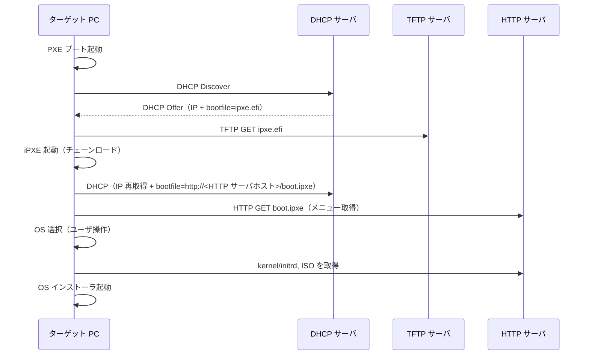
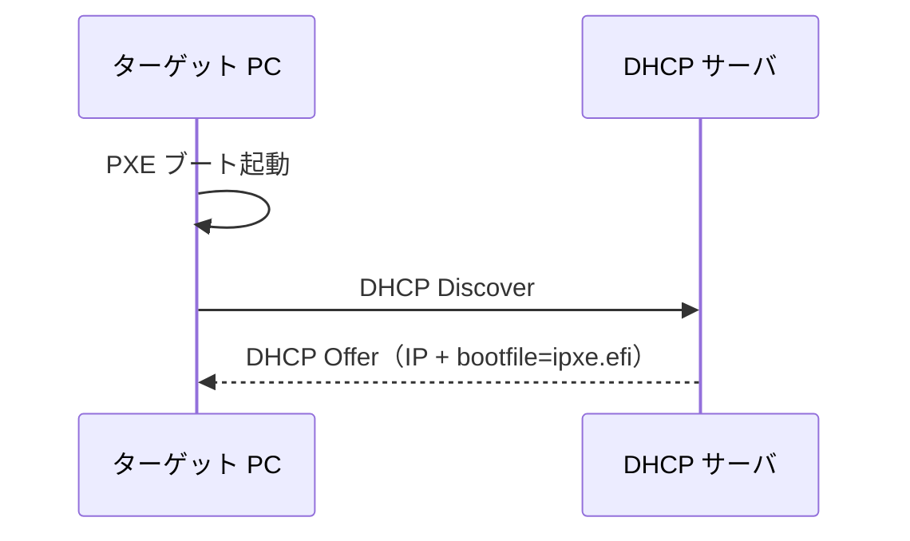

## 動機

PC に新しくOS をインストールする度に多くの苦労を伴っていた。具体的には、

- ISO のダウンロード（通常は大容量）
- USB メモリの準備（実態を伴い、論理的に完結しない）
- USB メモリへの ISO の書き込み（SSD でなければ Write は非常に低速）

特に、研究室では一度に何台もの PC をセットアップすることもあるため、効率化できれば恩恵は大きかった。

そこで以前から気になっていたネットワークブートを試すことにした。

## ネットワークブートとは

通常 PC の電源が入ると、SSD や HDD といったストレージにインストールされている OS を起動する。

ネットワークブートでは、NIC の機能を使い、ネットワークから OS を起動できる。この仕組みを使うことで、OS がインストールされていない PC がネットワーク経由で ISO を取得し、OS のインストーラを起動できる。

ネットワークブートには PXE ブート （PXE: Preboot eXecution Environment） という技術がベースとなる。

### PXE と iPXE

PXE ブートは UEFI の設定から有効化することで起動でき、NIC に格納された PXE クライアントをロードすることで、UEFI からネットワークスタックを利用できるようになる。具体的には、DHCP クライアントで IP アドレスを獲得したり、TFTP や HTTP 経由でファイルを取得したりできる。

PXE ブートでは、ロードする EFI 実行ファイルがあらかじめ設定されており、ユーザが任意の ISO を取得することは困難である。そこでよく用いられるのが iPXE である。

iPXE ではスクリプトを実行することができ、メニューを表示してキーボードでインタラクティブにインストールする OS を選択すると言ったかなり柔軟なことができる。あらゆる OS をインターネットから取得できる [netboot.xyz](https://github.com/netbootxyz/netboot.xyz) という OSS があったりする（今回は使わない）。

今回は、チェーンローディングを使用して、PXE ブートで iPXE 実行ファイルを取得して実行する。

### ブートシーケンス

PXE から iPXE を起動しインストーラを取得するまでの流れは以下の通りである。

要約すると、

1. PXE クライアントが DHCP サーバから IP アドレスと iPXE 実行ファイルの場所を取得。
2. TFTP サーバから iPXE 実行ファイルをダウンロード。
3. iPXE 実行ファイルを起動し、DHCP サーバから IP アドレスの再取得と、iPXE スクリプトの場所を取得。
4. HTTP サーバから iPXEスクリプトをダウンロード。
5. ユーザが OS を選択し、HTTP サーバから ISO を取得して実行。

つまり、iPXE を利用するためにやるべきことは、

- DHCP サーバの構築
- TFTP サーバの構築（ipxe.efi の配付）
- HTTP サーバの構築（boot.ipxe の配付）

## 実装

今回は移植を容易にするために Docker を利用してそれぞれのサーバを構築した。

### DHCP サーバの構築

以下の図は、先ほど示したブートシーケンス全体のうち、DHCP が関与する部分を抜き出したものである。DHCP サーバは PXE クライアントに IP アドレスを割り当て、iPXE 実行ファイルの場所を通知すればよい。

### TFTP サーバの構築

### HTTP サーバの構築
