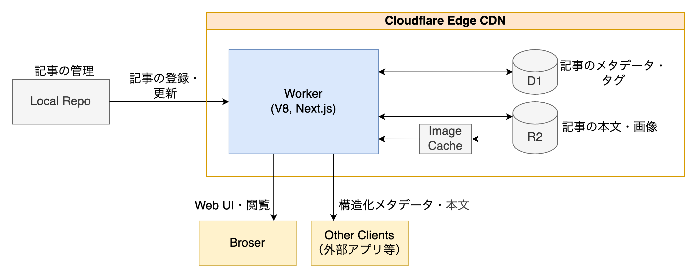
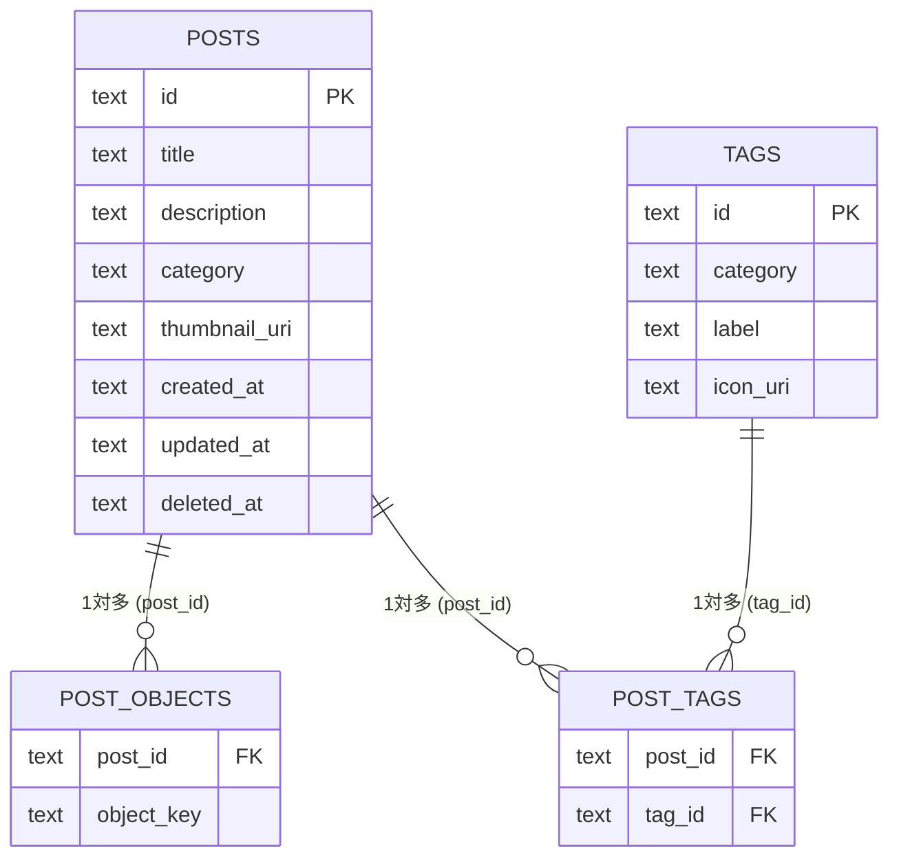
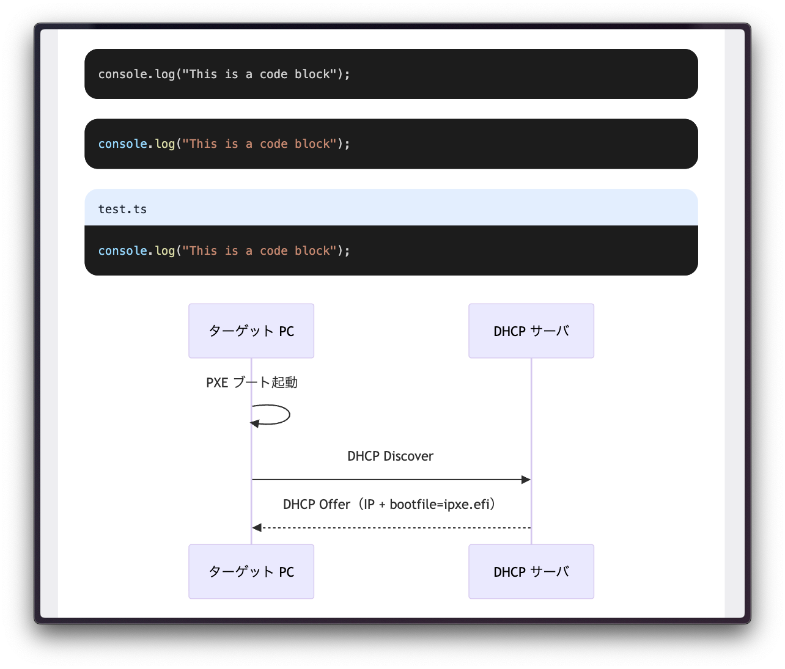

## はじめに

技術について検索をかけると、ソフトウェアエンジニアの方々の個人ブログをよく目にした。そこで自分も作ってみることにした。

なお、今回は [以前作ったブログ](https://jme-blog.vercel.app) の反省を活かして刷新した `v2.0` という位置付けである。

## ブログを作る・書く意味

1. **無限の時間を活用した技術力の向上**

    技術力を大きく向上できるのは、何にも縛られず心理的安全性が担保されている時だと思う。その中で、アーキテクチャや特定の技術スタックに際限なくこだわり、問題解決をしていくうちに自然と力がつく。また、普段から触っていからこそ実務でも力を発揮できる。

2. **文章構成力の向上**

    自分の考えを他人に正確・厳密に理解してもらうことは難しい。文章構成では、論文と同様に、同じ意味を伝えるにも順番、言い回し、例の有無などが需要であり、印象が大きく変わる。また、その中で必要な表現を見極めて冗長な文章を避けることも大切である。

    ブログだとしても、これらを意識することで、読解、説明、本質を理解する力が向上できる。

3. **自分に不足する知識の理解**

    一度誰かに説明するために文章にしてみると、自分が理解していない部分が明らかになる。何かを習得したと思ったら、一度文章に起こしてみた方が良い。その際に、疑問点を詳細に調べることで、周辺知識とともに知識をより強固にできる。

    また、それと同時に、「完全に理解した」がありえないことも体験できる。

## ブログで実現したこと

- **Markdown ベースの記事作成**

    以前作成したブログと同様、今回の Markdown を利用して記事を作成する方式を採用した。これは個人的に Markdown が好きである（[Markdown のすゝめ](https://blog.jmessk.net/posts/019a4005-b4b6-732d-93da-0eb5d2b38fd3)）ことに加え、AI との相性が良いのも理由である。

- **記事のカテゴリ・タグ管理**

    今回のブログでは、記事に対してカテゴリ・タグを付与できるようにした。これにより、記事の分類が容易になり、読者が興味のあるトピックを見つけやすく、検索性も向上した。

- **表現力の向上**

    本ブログでは、[Mermaid](https://mermaid.js.org/) で図を埋め込めるようにした。人間にはやはり視覚的な情報が必要である。今後は KaTeX による数式もサポートしたい。

- **見やすいデザイン**

    デザインは、シンプルですっきりとしたものを目指し、背景色やフォントサイズ、行間、ダークモード、レスポンシブなど細部にこだわった。また、テンプレートはあまり使わず、自分が納得できるデザインを一から作成した。

- **記事のサムネイル・画像投稿**
  
    記事ごとにサムネイル画像を設定できるようにした。また、記事内で利用する画像も R2 にアップロードして利用できるようにした。

## 学生に優しすぎる Cloudflare

今回、全体の基盤には Cloudflare を採用した。理由は圧倒的なコスパの良さである。Cloudflare のサービスをフル活用すれば、動的なブログを（ほぼ）無料でホストできる。

| サービス | 無料枠 |
| --- | --- |
| Workers | 10万リクエスト/日 |
| D1 (RDB) | 5万クエリ/日 (read)、5 GB |
| R2（オブジェクトストレージ） | 10 GB/月、1000万リクエスト/月 (Class B) |
| CDN | 多くのサービスで自動的に利用される |
| ドメイン | 年間 $10 ほど（中間マージンなし） |

ドメインに関しては、普段から Cloudflare Tunnel やメールサーバなどを利用しているため、追加のコストはない。

## アーキテクチャ



今回作ったブログのアーキテクチャは上記の通りである。ブログ全体は Cloudflare のエッジ CDN 上に構築されている。

- **サーバ**: 後述する OpenNEXT を利用し、Worker 上に Next.js をホスト
- **開発者（私）**: ローカルで Markdown 記事を作成し、スクリプトでアップロード・更新
- **ユーザ**: ブラウザを通じてブログを閲覧、または構造化されたデータを使って別のアプリケーションに利用

### 技術スタック

活用した技術スタックは以下の通りである。

#### ベース

- **Next.js**
- **TypeScript**
- **React**
- **[OpenNEXT Cloudflare](https://opennext.js.org/cloudflare)** （後述）
- **Drizzle ORM**

#### デザイン

- **Tailwind CSS**
- **[Shadcn UI](https://ui.shadcn.com/)**
- **[Shiki](https://shiki.matsu.io/)** （シンタックスハイライター）
- **[Mermaid](https://mermaid.js.org/)** （図の埋め込み）

#### Cloudflare

- **Cloudflare Workers**
- **Cloudflare D1**
- **Cloudflare R2**
- **Cloudflare Images** （画像の CDN 利用、最適化）
- **Cloudflare Domain**

#### Markdown 処理

- **[unified](https://unifiedjs.com/)**（テキスト処理パイプラインのコアフレームワーク）
- **[remark-parse](https://github.com/remarkjs/remark/tree/main/packages/remark-parse)**（Markdown 文字列を Markdown AST にパース）
- **[remark-gfm](https://github.com/remarkjs/remark-gfm)**（GitHub Flavored Markdown プラグイン）
- **[remark-rehype](https://github.com/remarkjs/remark-rehype)**（Markdown AST を HTML AST に変換）
- **[rehype-slug](https://github.com/rehypejs/rehype-slug)**（見出し要素に自動で ID 属性）
- **[rehype-toc](https://github.com/JS-DevTools/rehype-toc)**（見出しから目次を生成）
- **[rehype-react](https://github.com/rhysd/rehype-react)**（HTML AST を React コンポーネントツリーに変換）

### OpenNEXT の利用

ブログのホストに Cloudflare Workers を利用した理由の1つに、[OpenNEXT](https://opennext.js.org/) の存在がある。

> Next.js は、Remix、Astro、その他のモダンなフロントエンドとは異なり、異なるプラットフォーム間でセルフホストする手段がありません。Node.js アプリケーションとして実行することは可能ですが、Vercel と同じようには動作しません。

> これを修正するために長年にわたりいくつかの試みが行われてきましたが、大きく分けてオープンソース フレームワーク固有の実装とクローズド ソース製品固有の実装の 2 つのカテゴリに分類されます。
>
> Next.js は継続的に更新されるため、これらを個別に保守するのは非常に困難です。OpenNext は、これらすべての取り組みを統合する取り組みです。

元来、、Node.js を想定した Next.js を、Cloudflare Workers のような別のランタイムで動作させることは困難だった。

例えば、Cloudflare Workers から D1 に接続する API には環境変数を利用してアクセスする必要がある。しかし、Node.js と Cloudflare Workers では環境変数の扱いが異なるため、そのままでは動作しない（以下の例を参照）。

OpenNEXT これらに対する抽象を提供し、ランタイムを考慮せずにコードを書けるようになった。

```typescript:従来
// Node.js の場合
const column = await process.env.DB.prepare('SELECT * FROM table').run();

// Cloudflare Workers の場合
const column = await env.DB.prepare('SELECT * FROM table').run();
```

```typescript:OpenNEXT
const { env } = getCloudflareContext();
const column = await env.DB.prepare('SELECT * FROM table').run();
```

### データベース設計



記事やタグ、オブジェクトの管理を行うために、上記のようなテーブルを設計した。これが無料でできてしまう Cloudflare は素晴らしい。

#### テーブル説明

- **POSTS**

    記事に関する基本的なメタデータを保存

- **TAGS**

    タグに関する情報を保存

- **POST_TAGS**:

    記事とそれに関連するタグを紐付ける中間テーブル

- **POST_OBJECTS**:

    記事に関連する画像やファイルのオブジェクトキーを保存。 R2 上のオブジェクトを指す。主に記事を更新するときのために、記事に関連するオブジェクトを一括で削除する用途で利用する。

#### Markdown Front Matter

記事のメタデータは、Markdown ファイルの Front Matter 部分に YAML 形式で記述する。例えば、[この記事](https://blog.jmessk.net/posts/019a3ea8-9890-7c29-ad7e-6f5c36974d8c)は以下のようになる。

```markdown:example.md
---
title: ネットワークブートによる OS インストールの簡略化
description: PXE、iPXE ブートを使ってネットワーク経由でインストール ISO を実行できるようにした。
category: tech
tags: [netboot, pxe, ipxe, docker, dhcp, kea]
thumbnail_uri: ./ipxe.png
---

## 成果物

今回の成果物は以下に公開した。

...
```

### 外部アプリ向け API

ブログでは、外部アプリケーションから記事データを取得できる API を提供している。これにより、例えばモバイルアプリケーションや他のウェブサイトで記事を利用できる。

例えば、以下のようなエンドポイントがある。

#### 指定したタグを含む記事の一覧を取得

- エンドポイント: `/api/posts?tags=c,rust`
- 結果:

  ```json
  [
      {
          "id": "019a4018-0db8-7d51-a85b-0fa72ad33b99",
          "title": "Rust の文字列理解の続き（データ構造、メモリ、型強制）",
          "category": "tech",
          "created_at": "2024-03-19T00:00:00Z",
          "tags": [
              {
                  "id": "c",
                  "category": "teck",
                  "label": "C",
                  "icon_uri": "/api/images/C_Programming_Language.svg"
              },
              {
                  "id": "rust",
                  "category": "tech",
                  "label": "Rust",
                  "icon_uri": "/api/images/rust-logo-blk.svg"
              }
          ]
      },
  ]
  ```

#### タグ一覧の取得

- エンドポイント: `/api/tags`
- 結果:

  ```json
  [
      {
          "id": "chatgpt",
          "category": "tech",
          "label": "ChatGPT",
          "icon_uri": "/api/images/OpenAI-black-monoblossom.svg"
      },
      {
          "id": "dhcp",
          "category": "tech",
          "label": "DHCP",
          "icon_uri": null
      }
  ]
  ```

### その他工夫点

#### CDN による画像の配信と最適化を無料で行うために

Cloudflare Images を Workers から無料で利用することはできない。しかし、Cloudflare R2 にアップロードした画像を Cloudflare Images の URL 形式でアクセスすることで、画像の最適化やレスポンシブ配信を無料で実現できる。

```ts:src/app/api/images/[file_name]/route.ts
import { getCloudflareContext } from "@opennextjs/cloudflare";
import { NextRequest, NextResponse } from "next/server";


export async function GET(request: NextRequest, { params }: { params: Promise<{ file_name: string }> }) {
  const { env } = getCloudflareContext();

  const { file_name } = await params;
  const options = { cf: { images: {} } };

  // https://<R2_IMAGES_BASE_URL>/<file_name>
  const url = new URL(file_name, env.R2_IMAGES_BASE_URL);

  return await fetch(url.toString(), options);
}
```

#### Mermaid のバンドルサイズ問題

Mermaid は非常に便利なライブラリであるが、バンドルサイズが大きいため、Cloudflare Workers の上限 (3 MB) を超えてしまう。

そこで、良い方法ではないが、以下のようなコンポーネントを作成し、CDN 経由で Mermaid を読み込むようにした。さらに、ダークモードにも対応している。

```ts
"use client";

import { useEffect, useRef, useState } from "react";
import Script from "next/script";
import { useTheme } from "next-themes";

type Props = { code: string };


async function waitForMermaid() {
  return new Promise<void>((resolve) => {
    const check = () => (window as any).mermaid ? resolve() : setTimeout(check, 50);
    check();
  });
}


export function MermaidCDN({ code }: Props) {
  const ref = useRef<HTMLDivElement>(null);
  const { resolvedTheme } = useTheme();
  const [svgs, setSvgs] = useState<{ light?: string; dark?: string }>({});

  useEffect(() => {
    const init = async () => {
      await waitForMermaid();
      const mermaid = (window as any).mermaid;

      async function renderSvg(theme: string) {
        mermaid.initialize({ startOnLoad: false, theme });
        const { svg } = await mermaid.render(`mermaid-${theme}-${Date.now()}`, code);
        return svg;
      };

      const [lightSvg, darkSvg] = await Promise.all([
        renderSvg("default"),
        renderSvg("dark"),
      ]);

      setSvgs({ light: lightSvg, dark: darkSvg });
    };

    init();
  }, [code]);

  useEffect(() => {
    if (!ref.current || !svgs.light || !svgs.dark) return;
    ref.current.innerHTML = resolvedTheme === "dark" ? svgs.dark : svgs.light;
  }, [resolvedTheme, svgs]);

  return (
    <>
      <Script
        src="https://cdn.jsdelivr.net/npm/mermaid@11/dist/mermaid.min.js"
        strategy="afterInteractive"
      />
      <div ref={ref} className="mermaid" />
    </>
  );
}
```

ただ、ダークモード切り替えが上手くいかない場合が時々発生するため、今後改善したい。

#### コードブロックとシンタックスハイライト

コードブロックのデザインにはこだわっており、シンタックスハイライトには Shiki を利用している。コードブロックの言語指定やファイル名指定、Mermaid の埋め込みもサポートしている。

例えば、以下のように記述すると、

```markdown
    ```
    console.log("This is a code block");
    ```
    
    ```ts
    console.log("This is a code block");
    ```
    
    ```ts:test.ts
    console.log("This is a code block");
    ```
    
    ```mermaid
    sequenceDiagram
        participant Client as ターゲット PC
        participant DHCP as DHCP サーバ
    
        Client ->> Client: PXE ブート起動
        Client ->> DHCP: DHCP Discover
        DHCP -->> Client: DHCP Offer（IP + bootfile=ipxe.efi）
    ```
```

このように表示される。



## 今後の展望

今の所順調に開発が進んでいるが、今後もずっと使っていきたいため、以下のような改善を検討している。

- **`https://<ドメイン>/api/posts/<記事の ID>.md` で Markdown ファイルをダウンロード可能にする**

    URL の最後に `.md` をつけることで、記事の Markdown ファイルをダウンロードできる最近の流行りである。AI ネイティブのために実装したい。

- **専用の CMS による記事管理**

    現在は、記事管理リポジトリのシェルスクリプトで変更を反映している。将来的には [Payload](https://blog.cloudflare.com/ja-jp/payload-cms-workers/) という Cloudflare Workers 上で動作する CMS を利用したい。

    ※ Workers の無料プランでは実行時間的に厳しい。

## 終わりに

今回の新しいブログは、旧バージョンの反省を活かし、Web エコシステムの知見も増えたことから、結構良いものがでいたと感じている。今後も自分が納得できるまで改善を続けていきたい。
