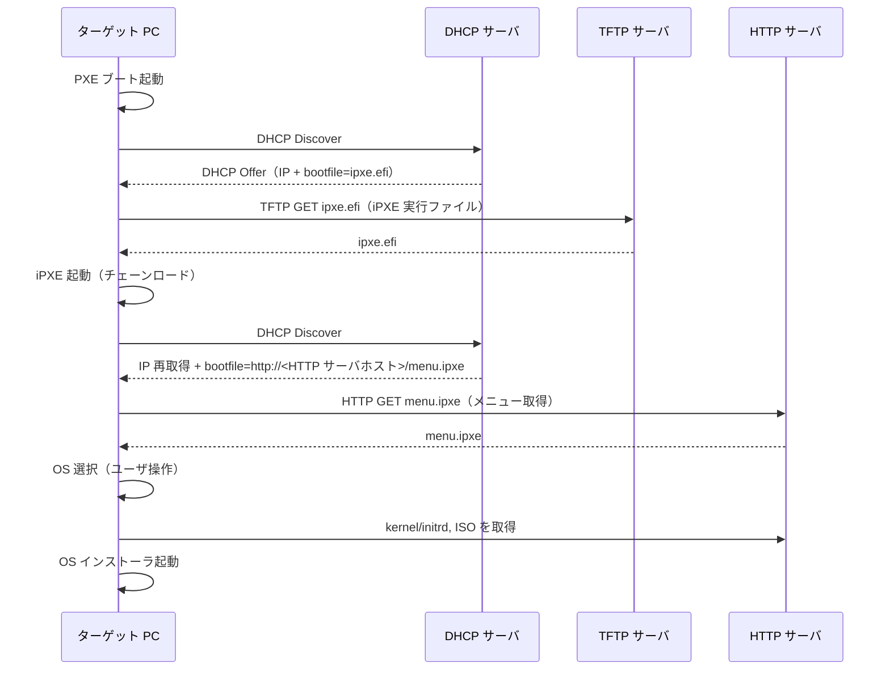
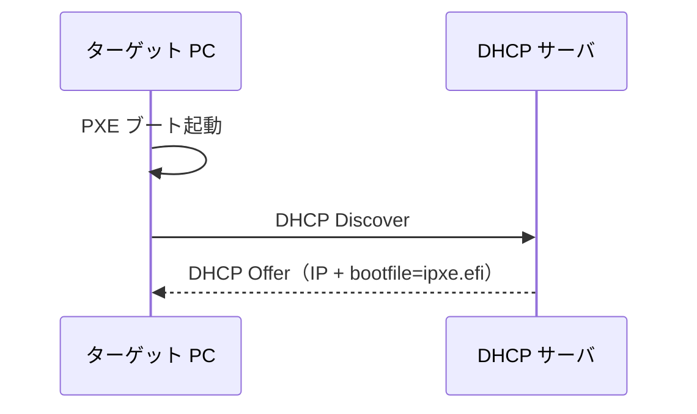
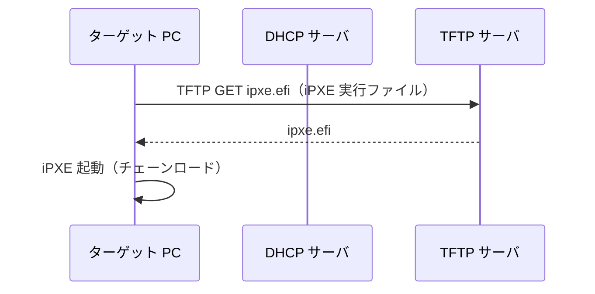
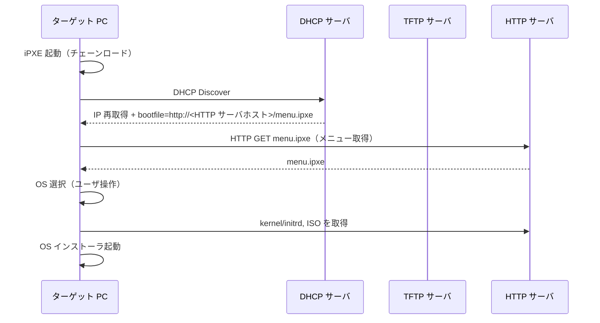
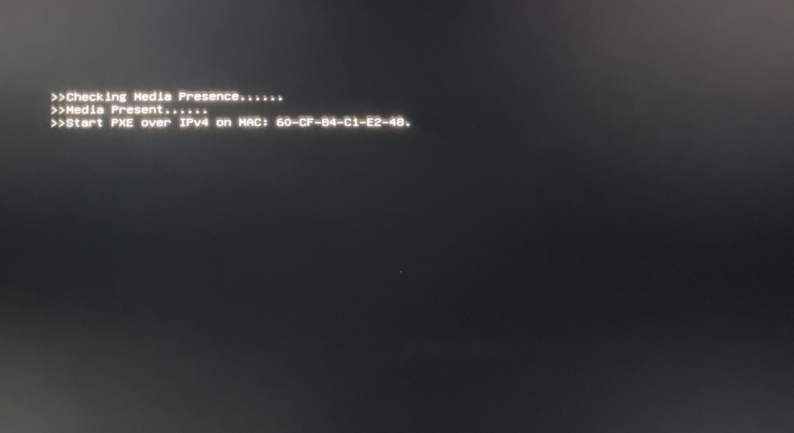
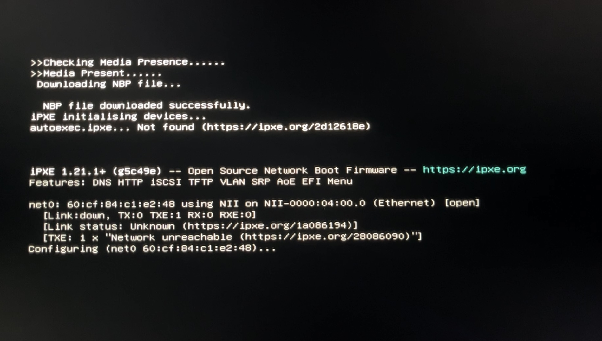
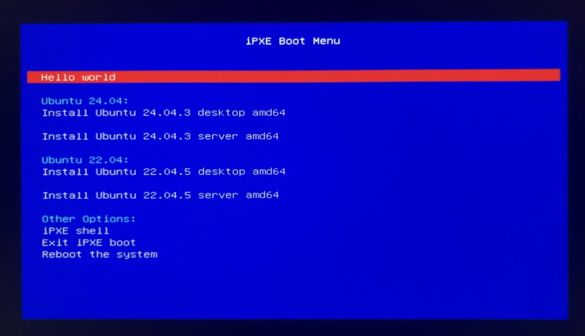

## 成果物

今回の成果物は以下に公開した。

<https://github.com/jmessk/ipxe-docker>
<https://github.com/jmessk/template-kea-docker>

## 動機

PC に新しくOS をインストールする度に多くの苦労を伴っていた。具体的には、

- ISO のダウンロード（通常は大容量）
- USB メモリの準備（実態を伴い、論理的に完結しない）
- USB メモリへの ISO の書き込み（SSD でなければ Write は非常に低速）

特に、研究室では一度に何台もの PC をセットアップすることもあるため、効率化できれば恩恵は大きい。

## ネットワークブートとは

通常 PC の電源が入ると、SSD や HDD といったストレージにインストールされている OS を起動する。

ネットワークブートでは、NIC の機能を使い、ネットワークから OS を起動できる。この仕組みを使うことで、OS がインストールされていない PC がネットワーク経由で ISO を取得し、OS のインストーラを起動できる。

ネットワークブートには PXE ブート（PXE: Preboot eXecution Environment）という技術がベースとなる。

### PXE と iPXE

- PXE ブート
    - UEFI の設定から有効化することで起動できる。
    - DHCP クライアントで IP アドレスを獲得したり、TFTP や HTTP 経由でファイルを取得したりできる。

PXE ブートでは、ロードする EFI 実行ファイルがあらかじめ設定されており、ユーザが任意の ISO を取得することは困難である。そこでよく用いられるのが iPXE である。

- iPXE
    - PXE で起動後にスクリプトを実行することができる。メニューを表示してキーボードでインタラクティブにインストールする OS を選択するといった、かなり柔軟なことができる。
    - あらゆる OS をインターネットから取得できる [netboot.xyz](https://github.com/netbootxyz/netboot.xyz) という OSS があったりする（今回は使わない）。

今回は、PXE → iPXE というチェーンローディングを使用する。

### ブートシーケンス

PXE から iPXE を起動しインストーラを取得するまでの流れは以下の通りである。



要約すると、

1. PXE クライアントが DHCP サーバから IP アドレスと iPXE 実行ファイルの場所を取得。
2. TFTP サーバから iPXE 実行ファイルをダウンロード。
3. iPXE 実行ファイルを起動し、DHCP サーバから IP アドレスの再取得と、iPXE スクリプトの場所を取得。
4. HTTP サーバから iPXEスクリプトをダウンロード。
5. ユーザが OS を選択し、HTTP サーバから ISO を取得して実行。

つまり、iPXE を利用するためにやるべきことは、以下の 3 つである。

- DHCP サーバの構築
- TFTP サーバの構築（ipxe.efi の配付）
- HTTP サーバの構築（boot.ipxe の配付）

## 実装

今回は移植・管理を容易にするために Docker を利用した。

### DHCP サーバの構築

以下の図は、先ほど示したブートシーケンス全体のうち、DHCP が関与する部分を抜き出したものである。

DHCP サーバは、

1. PXE クライアントに IP アドレスを割り当て、
2. iPXE 実行ファイルの場所を通知すればよい。



ISC DHCP 2022年に EOL を迎えたので、 同じく ISC の [Kea](https://www.isc.org/kea/) を使うことにした。

#### Kea の設定

ISC DHCP とは異なり、Kea は JSON で設定する。

```json:kea-dhcp4.conf
{
    "Dhcp4": {

        ...

        "client-classes": [
            {
                "name": "PXE client x86_64",
                "test": "option[93].hex == 0x0007 and not option[175].exists",
                "option-data": [
                    {
                        "name": "tftp-server-name",
                        "data": "192.168.16.1"
                    },
                    {
                        "name": "boot-file-name",
                        "data": "ipxe-x86_64.efi"
                    }
                ]
            },
            {
                "name": "iPXE client",
                "test": "option[175].exists",
                "option-data": [
                    {
                        "name": "boot-file-name",
                        "data": "http://192.168.16.1/menu.ipxe"
                    }
                ]
            },
        ],

        ...

    }
}
```

クライアントからの DHCP メッセージの Option を解析し、レスポンスにも Option を付与する。Kea では、既存の設定に `client-classes` を加える。

以下のサイトに DHCP Option 一覧がよくまとまっている。

<http://help.sonicwall.com/help/sw/jpn/7100/26/2/4/content/Network_DHCP_Server.042.12.html>

- `PXE client x86_64`
    - `option[93].hex == 0x0007`：クライアントの CPU アーキテクチャは x86_64 である。
    - `not option[175].exists`： iPXE で使用するので、PXE 時にはからである必要がある。
    - レスポンス： iPXE 実行ファイルを配信する TFTP サーバの場所と、そのファイル名。
- `iPXE client`
    - `option[175].exists`：iPXE の場合は存在する。
    - レスポンス：iPXE スクリプトの URL。

#### Dockerfile

```dockerfile:Dockerfile
FROM debian:bookworm-slim

RUN apt-get update && apt-get install -y --no-install-recommends \
    kea-dhcp4-server

RUN mkdir -p /var/lib/kea /var/run/kea /run/kea \
    && touch /var/lib/kea/kea-leases4.csv

ENTRYPOINT ["/usr/sbin/kea-dhcp4"]
CMD ["-c", "/etc/kea/kea-dhcp4.conf"]
```

- 公式イメージはなさそうだったので、debian 上に構築した （~~なぜ alpine を使わなかったのか~~)。
- `kea-lease4.csv` はログ用に必要らしい。ないとエラーになる。

#### Compose

```yml:compose.yml
services:
  dhcp:
    build: .
    network_mode: host
    volumes:
      - ./kea-dhcp4.conf:/etc/kea/kea-dhcp4.conf:ro
    restart: unless-stopped
```

先ほど作成した Config ファイルをマウントして Kea を起動する。

### TFTP サーバの構築

TFTP サーバは、DHCP サーバによって指定されたファイルを配信する。



#### Dockerfile

```dockerfile
FROM debian:bookworm-slim

RUN apt-get update && apt-get install -y \
    tftpd-hpa

ENTRYPOINT [ "in.tftpd" ]
CMD ["--foreground", "--verbose", "--address", "0.0.0.0:69", "--secure", "/srv/tftp/", "--user", "tftp"]
```

TFTP は古いのか情報も少なく、設定しても期待通りに動作しないことが多かった。よくわからない。

- 設定ファイルとして `tftpd-hpa` があるが、自分の環境では正しく読み込まれなかった。
- `--vervose` オプションを指定しても、特にログは出てこない。

#### Compose

`compose.yml` は HTTP サーバのものと共通である。

```yml:compose.yml
services:
  tftp-server:
    build:
      context: ./tftp-server
      dockerfile: Dockerfile
    # ports:
    #   - 69:69/udp
    network_mode: host
    volumes:
      - ./tftp-server/files:/srv/tftp
    restart: unless-stopped

  http-server:
      ...
```

- `/tftp-server/files` に配信したいファイルを配置し、`/srv/tftp` にマウントする。69 番ポートだけを使用したかったが、なぜかうまくいかなかったので、ホストのネットワークに直接接続した。

iPXE の実行ファイルは以下でダウンロードできる。今回は x86_64 向けをダウンロードした。

- x86_64：`/ipxe.efi`
- arm64：`/arm64-efi/ipxe.efi`

<https://boot.ipxe.org/>

### HTTP サーバの構築

HTTP サーバは以下を行う。

- iPXE スクリプト（`menu.ipxe` など）の配信
- OS の起動に必要なファイルの配信



#### NGINX

今回は NGINX を使用した。Config は最低限でシンプルになっている。

```nginx:nginx.conf
events {
    worker_connections 1024;
}

http {
    server {
        listen 80;
        root /var/www/html;

        client_max_body_size 0;
        sendfile on;
    }
}
```

#### Compose

TFTP サーバの時の `compose.yml` に `http-server` として追加する。

```yml:compose.yml
services:
  tftp-server:
    ...

  http-server:
    image: nginx:latest
    ports:
      - 80:80
    volumes:
      - ./http-server/nginx.conf:/etc/nginx/nginx.conf
      - ./http-server/files:/var/www/html/
    restart: unless-stopped
```

`/http-server/files` 以下に配置したファイルを配信できるようになっている。ディレクトリ構成は以下のようにした。

```plaintext
$ tree ./http-server/files
.
|-- menu.ipxe
|-- os
|   |-- debian
|   |-- fedora
|   `-- ubuntu
|       `-- 24.04.3
|           |-- server
|           |   |-- amd64
|           |   |   |-- boot.ipxe
|           |   |   |-- fetch-images.bash
|           |   |   |-- initrd
|           |   |   `-- vmlinuz
```

今回は、配信する ISO と同じ位置にも iPXE スクリプト（`boot.ipxe`）を配置し、iPXE のスクリプトのチェーン呼び出しを行う。これにより、

- `menu.ipxe` はインストール可能な OS 一覧を表示
- `boot.ipxe` は選択された OS に特化したインストールスクリプト

というように、役割分担を明確にし、インストールスクリプトを ISO の近くに置くことによるメンテナンス性向上も達成できる。

#### iPXE メニュー

iPXE ブートでは、DHCP サーバで指定されたスクリプト（`menu.ipxe`）を最初に読み込む。次のように設定した。

```ipxe:menu.ipxe
#!ipxe

set server-url http://192.168.10.1


:MENU
menu iPXE Boot Menu

item --gap --
item hello                                  Hello world

item --gap --
item --gap --                               Ubuntu 24.04:
item install-ubuntu-24.04.3-server-amd64    Install Ubuntu 24.04.3 server amd64

# ...（省略）

item --gap --
item --gap --                               Other Options:
item shell                                  iPXE shell
item exit                                   Exit iPXE boot
item reboot                                 Reboot the system

choose target && goto ${target}


# Hello

:hello
echo "Hello, world."
sleep 1
goto MENU


# Ubuntu 24.04

:install-ubuntu-24.04.3-desktop-amd64
set base-url ${server-url}/os/ubuntu/24.04.3/desktop/amd64
chain ${base-url}/boot.ipxe || goto MENU

# ...（省略）


# Other Options

:shell
shell
goto MENU

:exit
exit

:reboot
reboot
```

詳細については [iPXE のドキュメント](https://ipxe.org/cmd) を参照してほしい。

これだけでもかなりリッチなメニューを表示できる。

- `:MENU` 句：アイテム一覧を表示。`item` の 2 つ目の引数で指定されたラベルにジャンプする。
- `chain` コマンド：引数で指定された iPXE スクリプトを実行できる。ここでは特定の OS のインストールスクリプトを実行する。

###  OS インストール用 iPXE スクリプト

各 OS ごとに用意する `boot.ipxe` を次に示す。

```ipxe:boot.ipxe
#!ipxe

echo Booting Ubuntu 24.04.3 live server amd64 installer

kernel ${base-url}/vmlinuz ip=dhcp url=${base-url}/ubuntu-24.04.3-live-server-amd64.iso ---
initrd ${base-url}/initrd
boot || goto MENU
```

OS の `kernel` と `initrd` を専用のコマンドで指定し、`boot` コマンドを呼び出すことでインストールが開始する。

## 実行している様子

PC を起動すると、いつも通りマザーボードメーカーのロゴが表示され、


PXE ブートが開始され、



iPXE 実行ファイルが取得され、



設定したメニューが表示された。ユーザはここから OS を選択してインストールできる。



## まとめ

今回は、以前から気になっていたネットワークブートを実現した。結果として OS のインストールはだいぶ楽になったと思う。

## 今後の課題

実装はできたものの、いくつかの課題が残った。

- ISO、kernel、initrd を事前にダウンロードし、正しいパスに配置する必要がある。
- OS の最新バージョンの追跡は困難である。

キャッシュサーバや DNS、netboot.xyz を使ってどうにか透過的に自動化できないだろうか。
